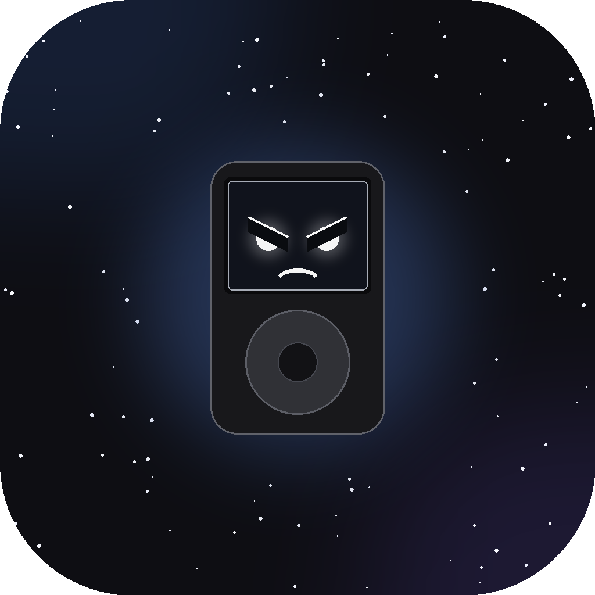

<p align="center">
  
</p>

<h1 align="center">Spindle</h1>

<p align="center">Everything on one spindle — a music library manager for macOS.</p>

---

**Beta software.** I run Spindle against my own library every day, but that's exactly why you shouldn't start that way. Point it at a *copy* of (part of) your collection first and play with it until you trust it. Spindle is careful by design — nothing is ever hard-deleted (removals go to a `_Verwijderd (Spindle)` folder next to your library) and every file operation can be undone with Cmd+Z — but a tool this young has to earn access to twenty years of collecting.

## What it is

Spindle treats a music collection like a warehouse with a receiving dock. Downloads arrive messy: missing tracks, no cover art, three spellings of the same artist, an MP3 rip of an album you already own in FLAC. The whole point of Spindle is that none of that reaches your library folder.

The workflow:

1. Download with whatever you like (I use Nicotine+) into a "New music" folder.
2. Spindle's **Inbox** picks everything up automatically and checks each album: tags complete? cover art present? tracklist complete compared to MusicBrainz? already in the library, and in which quality? Problems become flags on the album card.
3. Albums with serious problems are blocked from approval until you fix them in the built-in inspector, or consciously override.
4. **Approve** files everything into `Artist/Album (Year)/` with a filename template of your choice, shows you the move plan first, and verifies afterwards that every file actually landed.
5. From there your iPod gets fed: directly for Rockbox, or through an automatic ALAC mirror folder if you sync a stock iPod with iTunes/Finder.

There are no scan buttons. Spindle keeps a persistent index (SQLite) of your library and watches the folders; everything updates by itself.

## Install

**Homebrew** (macOS, recommended). If you don't have Homebrew yet, install it first — paste this in Terminal (from [brew.sh](https://brew.sh)):

```
/bin/bash -c "$(curl -fsSL https://raw.githubusercontent.com/Homebrew/install/HEAD/install.sh)"
```

Then install Spindle:

```
brew install rowspro/spindle/spindle
```

**Direct download:** grab a zip from the [latest release](https://github.com/rowspro/Spindle/releases/latest) — Apple Silicon, Intel, and an experimental Windows build. The macOS builds are signed and notarized, so they open without Gatekeeper warnings.

**Build from source:** you need the .NET 8 SDK.

```
git clone https://github.com/rowspro/Spindle.git
cd Spindle/SeekDownloader.Gui
./package-macos.sh osx-arm64     # or osx-x64; app appears in dist/
```

For a quick development run, `dotnet run` from the same folder works too.

**Updating:** Homebrew users get new versions with `brew update && brew upgrade spindle`. Direct-download users: grab the newest zip from the releases page and replace the app — your settings and library index live in `~/Library/Application Support/Spindle/` and survive the swap untouched.

**First start:** open Settings and set two folders — "New music" (where your downloads land) and "Music library" (your collection — again: a copy, the first week). The index builds itself from there.

## The tools

### Inbox

The review gate described above. Each album card shows its flags: `x lossy`, `x without tags`, `no cover`, `missing year`, `missing genre`, `duplicate versions`, `still receiving` (download not finished yet), and the completeness verdict from MusicBrainz, down to which track is missing ("missing track #7 'Touch'"). If the album already exists in your library, Spindle compares quality both ways: either "better quality there" (one click sweeps all of those to the trash) or "better quality than library — replace?" with a one-click replace.

The inspector behind the Fix button has a checklist of the album's state, an inline tag table, cover paste from the clipboard (applies to the whole album), per-file playback to verify a download by ear, and — when one album arrived from two sources — a version picker that shows both with bitrate and size and keeps the one you choose.

The whole thing drives with the keyboard: J/K to move, Enter to inspect, A to tick, X to delete, Esc to go back.

### Library

Your collection as an album grid with covers, search-as-you-type and filters. Quick edits (artist, album, genre, year) write to all tracks of the album; the album-artist field autocompletes from your own library so spellings stay consistent. Space plays the selected album in the mini player.

### Health and the Library Doctor

A dashboard with a health score, problem counters and a format-mix bar (FLAC/MP3/WAV/ALAC/other). The interesting part is the **Library Doctor**: run a checkup and it finds artist spelling variants (AC/DC vs AC & DC — pick the right one and it retags and moves everything), files that drifted from your naming template, non-canonical genres, and album oddities like mixed quality or track-number gaps. Every fix is a single undo batch.

### Metadata

A tag editor with three modes: a form for one album at a time, a spreadsheet-style table for bulk edits, and filename↔tag converters. Album matching pulls a complete, consistent release (titles, year, genre, cover) from iTunes, Discogs or MusicBrainz. AcoustID fingerprinting identifies untagged files. Artwork works the way Mp3tag users expect: paste from clipboard, apply to the whole album.

### Duplicates

Two passes: a fast one on tags, an optional second one using acoustic fingerprints for files whose tags lie. Best version preselected; rejected copies go to a separate folder, not the void.

### Wantlist

Follow artists and Spindle compares their official discography (MusicBrainz) against your index. Missing albums go on a wantlist with a copy-button for the search term; once an album lands in your library, it ticks itself off.

### iPod: Transfer and iTunes mode

A toggle in Settings picks your world. **Rockbox:** the Transfer tab syncs straight from your library — what's on the iPod is pre-ticked, unticking removes it (iTunes-style sync), with progress, free-space and disconnect protection, and copies staged through RAM so a yanked cable can never leave a half file behind. **iTunes / stock iPod:** Spindle maintains an ALAC mirror of your library in the background — FLAC becomes iPod-ready ALAC (with Artist set to Album artist so sorting behaves), MP3/AAC copied as-is, removed albums cleaned up. You point iTunes/Finder at the mirror and never convert anything by hand.

### Galaxy

Your collection as a 3D point map: genres form clusters, newer music sits closer to the core, and opening the tab makes the whole thing fly out from the center. Click a point to jump to that album. Mostly useless, completely necessary.

## The small stuff

- Cmd+F opens a command palette (jump to any screen or album).
- Cmd+Z undoes the last file/tag batch; the clock icon in the top bar opens an activity register of everything Spindle did this session.
- A mini player lives at the bottom; space is play/pause almost everywhere.
- During transfers and mirror syncs the Mac is kept awake (`caffeinate`).
- If your library lives on an external SSD: Spindle notices when the volume unmounts, says so instead of showing an empty library, and recovers by itself when it returns.
- Settings warns you in red if your inbox and library folders overlap.
- Dark mode, obviously.
- Crashes (rare, knock wood) leave a readable log in `~/Library/Application Support/SeekDownloader/crash.log` — include it in bug reports.

## Windows

The Windows build starts and works for library management, tagging and the inbox. The built-in player and ALAC conversion rely on macOS system tools (`afplay`, `afconvert`) and don't work there yet.

## Heritage and license

This repo started life as a GUI for [MusicMoveArr's SeekDownloader](https://github.com/MusicMoveArr/SeekDownloader), a Soulseek command-line downloader — and this README used to describe that CLI. The project has since pivoted completely: downloading was removed (dedicated clients do it better), the CLI code left the repo, and Spindle became a pure library manager. Credit to MusicMoveArr for the original foundation.

License: GPLv3.
